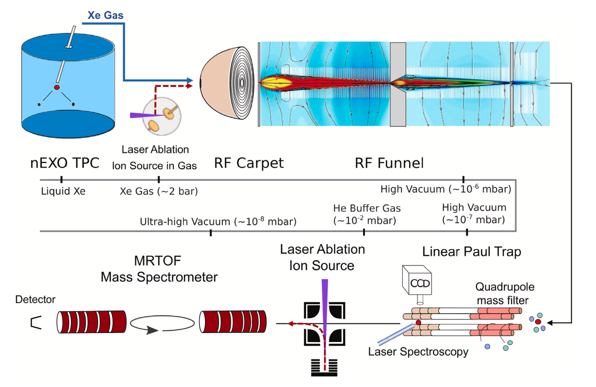

# Ba-Tagging

<figure markdown>
  {: style="height:300px;width:500px"}
  <!-- Within fig caption normal markdown linking doesn't work, instead use a href attribute -->
  <figcaption>The Ba-Tagging Setup </figcaption>
</figure>

[‘Searching for a needle in a haystack;’ A Ba-tagging approach for an upgraded nEXO experiment. Rasiwala, H., Murray, K., Lan, Y., Chambers, C., Cvitan, M., Brunner, T., ... & Yang, L. (2023).  Nuclear Instruments and Methods in Physics Research Section B: Beam Interactions with Materials and Atoms, 541, 298-300.](https://www.sciencedirect.com/science/article/pii/S0168583X2300246X)