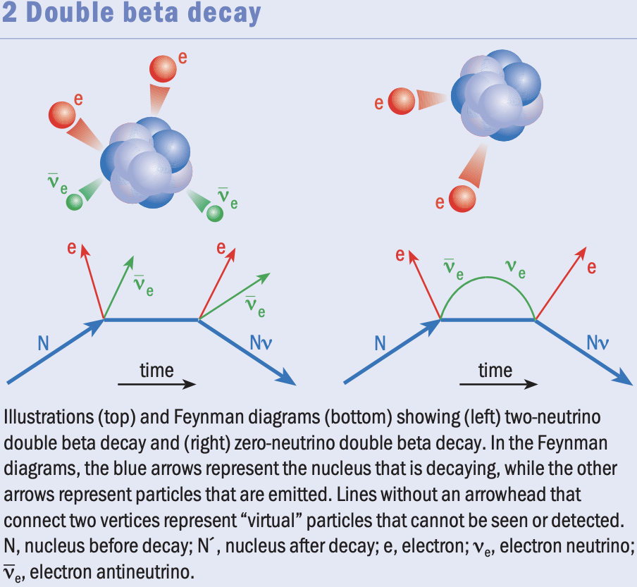

# The Search for Neutrinoless Double Beta Decay

<figure markdown>
  {: style="height:300px;width:500px"}
  <!-- Within fig caption normal markdown linking doesn't work, instead use a href attribute -->
  <figcaption>Double Beta Decay and Neutrinoless Double Decay </figcaption>
</figure>

[In search of no neutrinos. Giorgio Gratta and Naoko Kurahashi 2010 Phys. World 23 (04) 27](http://grattalab3.stanford.edu/neutrino/Publications/Gratta_2010_Phys._World_23_31.pdf)