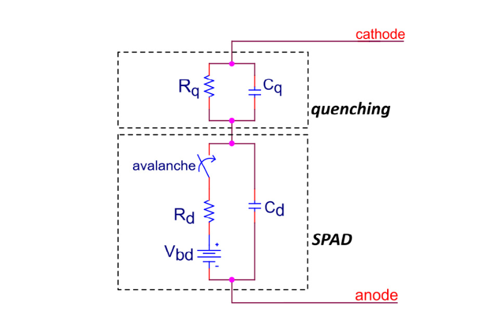

# Silicon Photomultipliers

<figure markdown>
  {: style="height:300px;width:500px"}

  <!-- Within fig caption normal markdown linking doesn't work, instead use a href attribute -->
  <figcaption>A single SPAD circuit within a SiPM</figcaption>
</figure>

[Understanding and simulating SiPMs. Acerbi, F., & Gundacker, S. (2019). Nuclear Instruments and Methods in Physics Research Section A: Accelerators, Spectrometers, Detectors and Associated Equipment, 926, 16-35.](https://www.sciencedirect.com/science/article/pii/S0168900218317704)